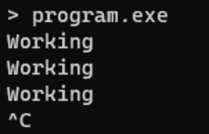
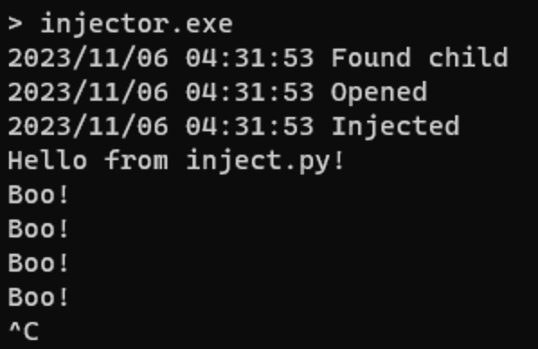

<div align="center">


<h1 align="center">PyPatch</h1>
<h3>Inject arbitrary code into any running python interpreter</h3>
</div>

---

## Overview

pypatch includes:

- [PyPatch injection executor](https://github.com/saucesteals/pypatch/blob/main/cmd/injector) to run a pre-packed python program and inject code at any time (before startup/after startup)

- [Python injector library](https://github.com/saucesteals/pypatch/blob/main/pypatch) to run arbitrary code with any python3x.dll

- [Process injector library](https://github.com/saucesteals/pypatch/blob/main/inject) to inject dlls

## Usage

- Write the payload you want to inject in `inject.py`
- Compile a DLL with the payload with `make dll`
- Compile an injector (in `cmd/injector`) with your `program` and `dll` paths

## Example

### `program.py` with **pyinstaller**

```py
import time

def main():
  while True:
    print("Working")
    time.sleep(1)

if __name__ == "__main__":
  main()
```



---

### `inject.py` with pypatch executor

```py
import os
print("Hello from inject.py!")
print = lambda *args, **kwargs: os.write(1, b"Boo!\n")
```



---

## Contributing

Contributions are welcome!

- **[Submit Pull Requests](https://github.com/saucesteals/pypatch/pulls)**
- **[Report Issues](https://github.com/saucesteals/pypatch/issues)**

## License

Distributed under the GNU GPL v3.0 License. See `LICENSE` for more information.
